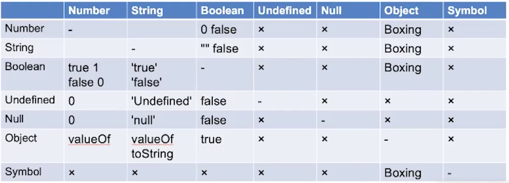

# Week03

## 本周作业

[number2string.js](./number2string.js)  

[string2number.js](./string2number.js)  

## Expression

> 类型转换规则


### MemberExpression

    - a.b

    - a[b]

    - foo`string`

    - super.b

    - super[b]

    - new.target  可以用来判断构造函数是否是被 new 调用的

    - new Foo()

    - new Foo 优先级 低于带括号的 new

### CallExpression

    - foo()

    - super()

    - foo()[b]

    - foo().b

    - new a()[b]

### LogicExpression

    - &&

    - ||

### ConditionalException

    - ? :

## Statement

### Completion Record

- [[type]]: normal、break、continue、return、throw

- [[value]]: Types

- [[target]]: label 

### 简单语句

- ExpressionStatement

    例子：
    ```
    a = 1 + 2;
    ```

- EmptyStatement

    例子：
    > ;

- DebuggerStatement

    例子：
    > debugger;

- ThrowStatement

    例子：
    > throw new Error;

- ContinueStatement

    例子：
    > continue;  
    > continue label;

- BreakStatement

    例子：
    > break;  
    > break label;

- ReturnStatement

    例子：
    > return;  
    > return 1 + 2;

### 复合语句

- BlockStatement

    结构：
    ```
    {
        Statement1;
        Statement2;
        Statement3;
        ...
    }
    ```

    Complation Record

    ```
    [[type]]: normal 表示可以继续往下执行
    [[value]]: --
    [[target]] --
    ```

    > 作用1：包裹多条语句形成一条语句  
    > 作用2：在新语法中，为 let const 提供新的作用域

- IfStatement

- SwitchStatement

- IterationStatement

    - while (stmt) stmt

    - do stmt whike(stmt)

    - for (stmt;stmt;stmt) stmt

    - for (stmt in stmt) stmt

    - for (stmt of stmt) stmt

    - for await (stmt of stmt) stmt

    > 如果循环某个语句里面含有 contunie/break，则这个语句的 complation record type 就会变成 contunie/break，并被循环消费掉

- WithStatement

- LabelledStatement

- TryStatement